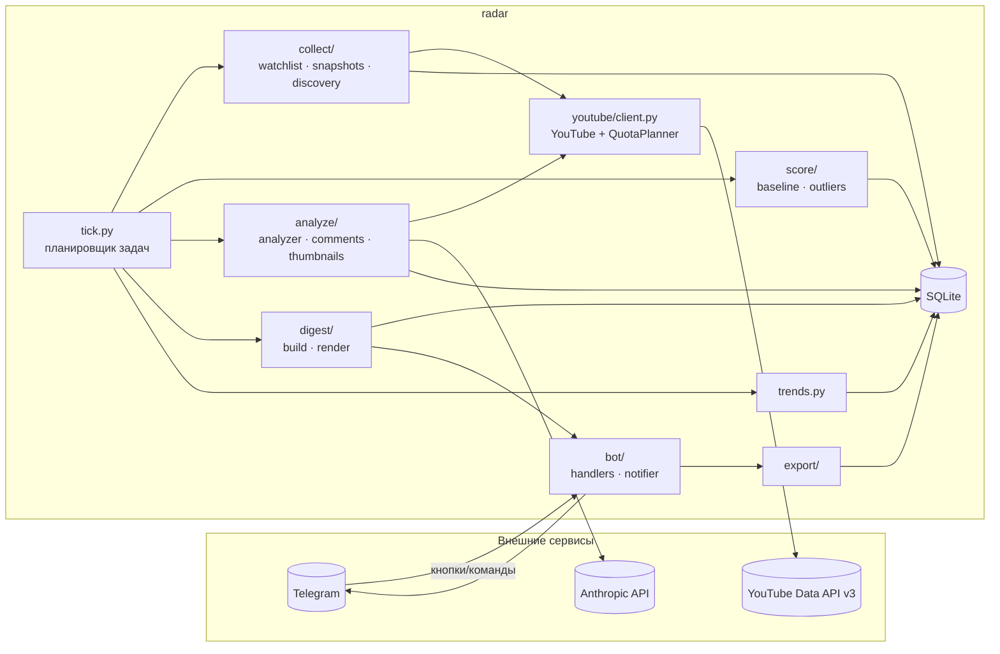

# Архитектура

Один процесс `radar tick` (launchd, каждые 15 минут) выполняет задачи с наступившим сроком; отдельный процесс `radar bot` обслуживает кнопки и команды. Всё состояние — в SQLite (`data/radar.db`).

## Поток данных
1. **Сбор.** Watchlist: `playlistItems.list` по uploads-плейлистам → новые id → `videos.list` батчами по 50 → `videos` + первый снимок. Снимки: `videos.list` по видео, у которых подошёл срок (младше 14 дней — каждые 6 ч, до 60 дней — раз в сутки). Discovery: `search.list` → каналы → `channels.list` → кандидаты в диапазоне подписчиков.
2. **Скоринг.** Базлайн канала по формату (медиана и MAD лог-просмотров зрелых видео), ratio, robust z, velocity → score и reason_flags → таблица `outliers`.
3. **Анализ.** Аутлайеры выше порога → комментарии + превью + метаданные + профиль → LLM → `Analysis` (строгая схема), кеш по хешу входа.
4. **Дайджест.** Утром топ-N по нишам → карточки с кнопками → Telegram. Нажатия → `feedback`, экспорт в `data/exports/`.
5. **Тренды.** Признаки заголовков, форматы, длительности, время публикации — lift среди аутлайеров против всех видео; еженедельный отчёт и `content_hints.yaml`; рекомендации по порогам из фидбэка «Не то».

## Границы
- Внешние сервисы — только через `youtube/`, `llm/`, `bot/notifier.py`; у каждого есть фейк.
- Контракты — `schemas.py`; конфиг — `config.py`; БД — `db.py` (единственный модуль с SQL).
- Идемпотентность: снимки по сроку, `task_runs`, upsert аутлайеров, кеш анализа, дайджест один на дату.

## Задачи tick (по порядку)
`seed_channels` → `watchlist` → `snapshots` → `discovery` (+ алерт о кандидатах) → `score` → `analyze` (синхронно или Batch API) → `digest` (+ архив Markdown) → `trends_weekly` (+ вопросы зрителей, рекомендации) → `backup` → `alerts`. Ошибка задачи → алерт; недоставка → повтор (≤ 4). Процесс бота отдельно: команды, кнопки, watchdog «tick встал».

## Таблицы (схема v3)
`niches`, `channels`, `videos` (+`gone_at`), `video_snapshots` (append-only), `channel_baselines`, `outliers`, `analyses`, `llm_usage`, `llm_batches`, `quota_ledger`, `digests`, `feedback`, `topic_suggestions`, `task_runs`, `kv`, `alerts`.
